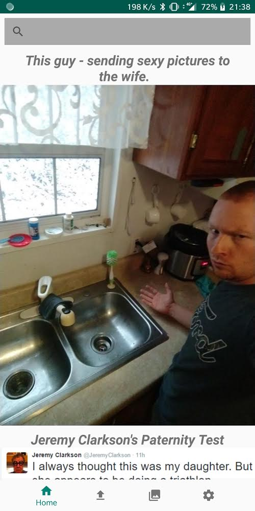
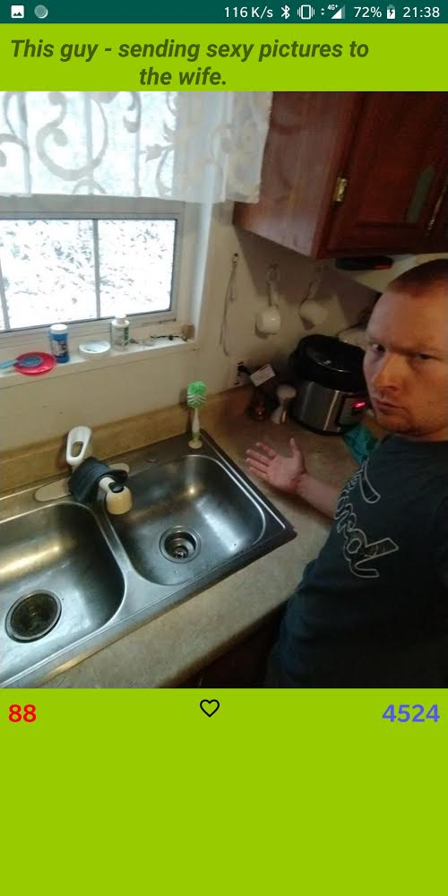

# Home

## Overview

Home allows the user to discover new posts on **Imgur**. The user can also search for a specific tag to filter posts.

## How To

On the **Home** tab, scroll through posts sorted by user preference defined in the **Settings** tab.
The user can search for tag in the search bar at the top of the view.
If the user is interessed in a post, he can click on the image to obtain the detailed view of the post where he can get additionnal informations.

