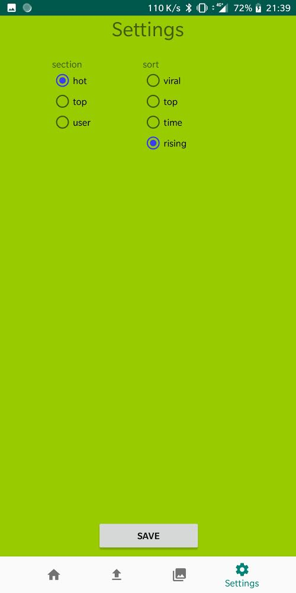

# Settings

## Overview

Settings allow the user to configure which section do display on the home page and the sort of this section.

## How To

On the **Settings** tab, select the section between hot, top and user on the left of the screen.
Same thing for the sort, select between viral top time and rising on the right on the screen to choose an order on display.
When both selections are done click `SAVE` to validate.
